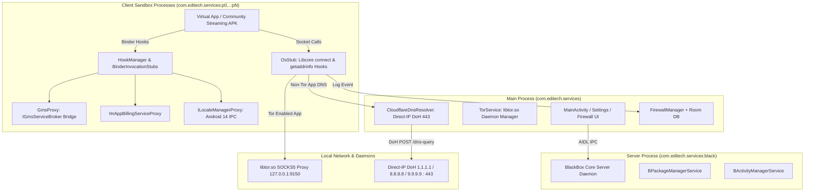

# Developer Documentation - Vortex One (v2.0.3)

This document contains authoritative technical details regarding the architecture, virtualization engine hooks, Tor privacy engine, encrypted DNS-over-HTTPS (DoH) resolver, firewall inspection, and build workflows of **Vortex One**.

---

## 🛠️ Technology Stack & Dependencies

- **Language**: Kotlin 2.2.10 (App, UI & Firewall) + Java 8/17 (Virtualization Engine Core) + C++20 (NDK Native Hooks)
- **Min SDK**: 21 (Android 5.0 Lollipop)
- **Target SDK**: 34 (Android 14)
- **UI Framework**: XML ViewBinding + Material Components (Strictly No Compose for optimum Leanback rendering performance on low-end Smart TV chipsets)
- **Virtualization Engine**: BlackBox Core (`:engine:Bcore`, Apache 2.0)
- **Embedded Network Engine**: Native Tor Daemon (`libtor.so`, SOCKS5 on `127.0.0.1:9150`, DNS listener on `127.0.0.1:5453`, control port `9151` — offsets chosen to avoid clashing with a system Orbot on `9050`)
- **DNS Resolver**: `CloudflareDnsResolver` (Native RFC 8484 DNS-over-HTTPS on port 443, direct-IP to `1.1.1.1` / `1.0.0.1` / `8.8.8.8` / `8.8.4.4` / `9.9.9.9` raced in parallel, Google DoH JSON API as last-resort failover, isolated `SSLContext`, LRU in-memory cache; no unencrypted UDP 53 fallback)
- **Database**: Room Persistence Library (SQLite) with automated 7-day log retention
- **Target Architectures**: ARM64 (`arm64-v8a`), ARMv7 (`armeabi-v7a`), Universal
- **`applicationId`**: `com.editech.services` — **identificador histórico congelado** (el proyecto se llamaba "MediaService"). Es la identidad de instalación ante el `PackageManager` y no es visible para el usuario (el launcher muestra `app_name` = "Vortex One"). No debe cambiarse: `BEnvironment` (`engine/Bcore/.../core/env/BEnvironment.java`) deriva `/data/data/<applicationId>/blackbox` y `/sdcard/Android/data/<applicationId>/files/blackbox` del package del host, así que un cambio dejaría huérfanos los datos de todas las instalaciones desplegadas, sin migración posible.
- **APK release naming**: automatizado en `app/build.gradle.kts` (`androidComponents { onVariants ... }`) → `VortexOne-vX.Y.Z-<abi>.apk`.

---

## 🏗️ Architecture & Multi-Process Model

Vortex One runs a multi-process architecture to isolate virtualized applications from the host UI, prevent deadlocks, and enforce kernel-level process boundaries:



---

## 🧩 Engine Subsystem Deep-Dive (`:engine:Bcore`)

### 1. Android TV Leanback Launch Resolution (`BPackageManager.java`)
Standard Android TV applications declare only `android.intent.category.LEANBACK_LAUNCHER` in their manifest. [`BPackageManager.java`](file:///home/edison/AndroidStudioProjects/MediaService/engine/Bcore/src/main/java/top/niunaijun/blackbox/fake/frameworks/BPackageManager.java#L125-L135) implements fallback intent resolution:

```java
// Support Android TV apps declaring only LEANBACK_LAUNCHER
if (ris == null || ris.size() <= 0) {
    intentToResolve.removeCategory(Intent.CATEGORY_LAUNCHER);
    intentToResolve.addCategory(Intent.CATEGORY_LEANBACK_LAUNCHER);
    intentToResolve.setPackage(packageName);
    ris = queryIntentActivities(intentToResolve, 0,
            intentToResolve.resolveTypeIfNeeded(BlackBoxCore.getContext().getContentResolver()),
            userId);
}
```

### 2. Android 13/14 `LocaleManager` IPC Hook (`ILocaleManagerProxy.java`)
Android 14 enforces strict calling package UID checks in `LocaleManagerService`. [`ILocaleManagerProxy.java`](file:///home/edison/AndroidStudioProjects/MediaService/engine/Bcore/src/main/java/top/niunaijun/blackbox/fake/service/ILocaleManagerProxy.java) proxies `Context.LOCALE_SERVICE` to prevent `SecurityException`:

```java
public class ILocaleManagerProxy extends BinderInvocationStub {
    public ILocaleManagerProxy() {
        super(BRServiceManager.get().getService("locale"));
    }
    // Intercepts setApplicationLocales and getApplicationLocales
}
```

### 3. Google Play Services & Billing Virtualization (`GmsProxy.java` & `IInAppBillingServiceProxy.java`)
- **`GmsProxy.java`**: Hooks `com.google.android.gms.common.internal.IGmsServiceBroker`, inspecting `GetServiceRequest` via reflection to rewrite `mCallingPackage` and `clientPackageName` to `BlackBoxCore.getHostPkg()`. This enables Google Sign-In, Firebase Auth, and Google Cast pass-through.
- **`IInAppBillingServiceProxy.java`**: Responds to `isBillingSupported`, `getSkuDetails`, and `getPurchases` queries for `com.android.vending.billing.IInAppBillingService` to ensure community apps checking Pro licenses run reliably.

### 4. GPU & Native Hardware Pass-Through (`VirtualSpoof.cpp`)
Native system properties (`ro.hardware`, `ro.hardware.egl`, `ro.product.board`) are preserved to expose the true host hardware (e.g. ARM Mali GPU on Amlogic chipsets), enabling full 60 FPS hardware video decoding via `MediaCodec` and `Codec2`.

---

## 🛡️ Network & Privacy Subsystem

### 1. Zero DNS Leaks & Tor Per-App Routing (`OsStub.java`)
Network interception occurs at the libc layer via Libcore hooks in [`OsStub.java`](file:///home/edison/AndroidStudioProjects/MediaService/engine/Bcore/src/main/java/top/niunaijun/blackbox/fake/service/libcore/OsStub.java):

```java
// 1. DNS Interception (android_getaddrinfo / getaddrinfo)
if (isTorEnabledForPackage(pkg)) {
    // Allocate a virtual IP in 127.192.0.0/10 and route DNS remotely through Tor exit nodes
    String virtualIp = getOrAllocateVirtualIp(domainNode);
    return new InetAddress[]{ InetAddress.getByAddress(domainNode, InetAddress.getByName(virtualIp).getAddress()) };
} else {
    // Non-Tor: encrypted resolution via direct-IP DoH (1.1.1.1:443, servers raced in parallel)
    InetAddress[] dohAddrs = resolveViaCloudflareDoH(domainNode);
    if (dohAddrs != null && dohAddrs.length > 0) return dohAddrs;
}

// 2. Socket Connection (Os.connect)
if (isTorEnabledForPackage(pkg)) {
    // SOCKS5 ATYP 0x03 Domain Tunneling to 127.0.0.1:9150 with Fail-Safe Kill-Switch
    return connectViaTorSocks5(who, method, args, address, port, pkg);
}
```

### 2. DNS-over-HTTPS (DoH) Engine (`CloudflareDnsResolver.kt`)
- **RFC 8484 Native DoH on Port 443**: `POST /dns-query` (wire-format) to direct IPs `1.1.1.1`, `1.0.0.1`, `8.8.8.8`, `8.8.4.4`, `9.9.9.9` — connecting to the literal IP (never a hostname) so no bootstrap DNS query ever leaks, with the `Host:` / SNI set per provider (`cloudflare-dns.com`, `dns.google`, `dns.quad9.net`).
- **Parallel Race + Retry**: All servers are queried concurrently and the first valid answer wins; a fully-failed race is retried (`RETRY_ATTEMPTS`) instead of giving up on the first transient blip. Last-resort failover is the Google DoH JSON API (`https://8.8.8.8/resolve`, `Host: dns.google`). There is **no** unencrypted UDP 53 fallback.
- **Isolated TLS Provider**: Builds and warms its own `SSLContext` early in the guest process lifecycle, so a bundled Google client library that swaps the process-wide default `SSLSocketFactory` cannot break resolution ("Attempted to use SSL unpatched").
- **Concurrent In-Memory Cache**: `ConcurrentHashMap<String, CachedEntry>` with 5-minute TTL.

### 3. Integrated Firewall Engine (`FirewallManager.kt`)
- **Room Database**: Persists connection logs and per-app blocking rules.
- **Automated Pruning**: Background worker purges connection records older than 7 days.
- **Bandwidth Throttling**: Limits Tx/Rx throughput per package.

---

## 🚀 Build & Release Workflows

### Prerequisites
- JDK 17+ (build verified on JDK 21)
- Android SDK — `compileSdk 37`, `targetSdk 34`, `minSdk 21`
- Android NDK `29.0.13846066` (required for native C++ hooks in `:engine:Bcore`)
- Gradle 9.5 (wrapper) · Android Gradle Plugin 9.3.0 · Kotlin 2.2.10

### Gradle Commands

```bash
# Compile Debug APKs (with full logcat output)
./gradlew assembleDebug

# Compile Production Release APKs (Obfuscated with ProGuard/R8)
./gradlew clean assembleRelease

# Run Unit & Framework Tests
./gradlew test
```

### Build Artifacts
Binaries are generated under `app/build/outputs/apk/release/`, named deterministically by
`androidComponents { onVariants }` in `app/build.gradle.kts`:
- `VortexOne-v2.0.3-universal.apk`
- `VortexOne-v2.0.3-arm64-v8a.apk`
- `VortexOne-v2.0.3-armeabi-v7a.apk`

---

## 📺 Android TV UI Design Guidelines

When creating or modifying layouts:
1. **XML ViewBinding Only**: Never use Jetpack Compose.
2. **Focus Selectors**: All interactive elements must have `android:focusable="true"` and `android:foreground="@drawable/selector_tv_focus"` with glowing cyan highlight (`#38BDF8`).
3. **D-Pad Key Dispatch**: Override `dispatchKeyEvent` in Activities to handle focus transitions seamlessly across vertical and horizontal lists.

---

*Developer Guide for Vortex One v2.0.3.*
