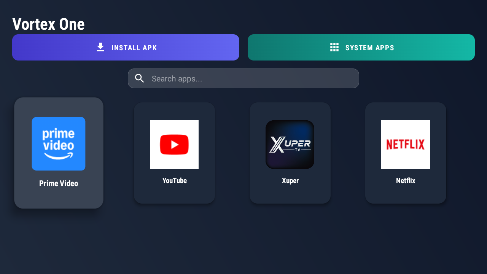
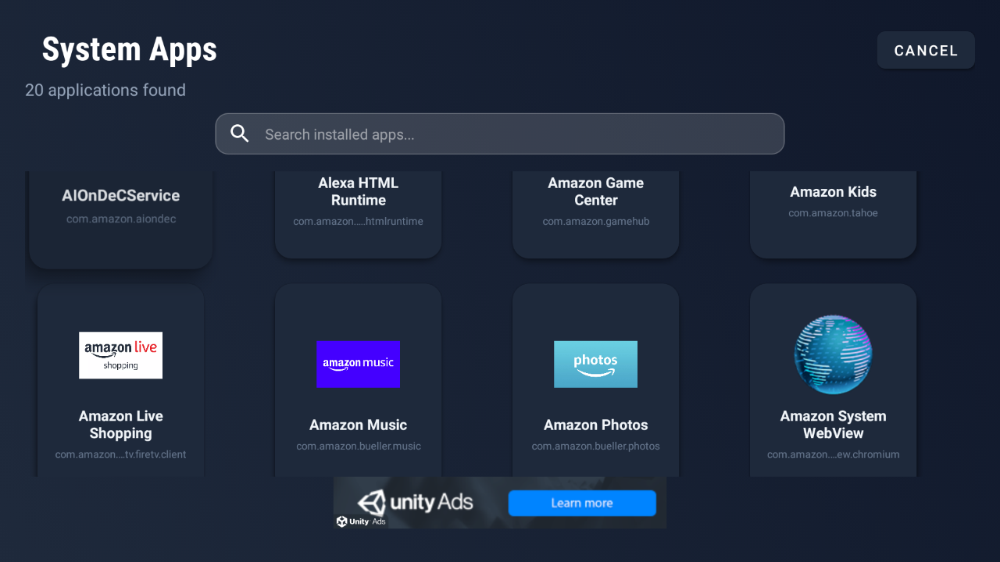
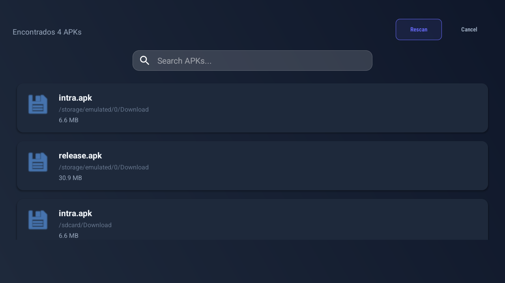
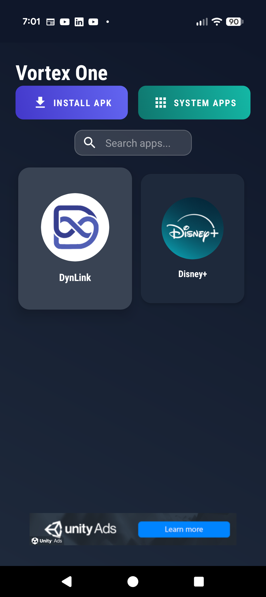
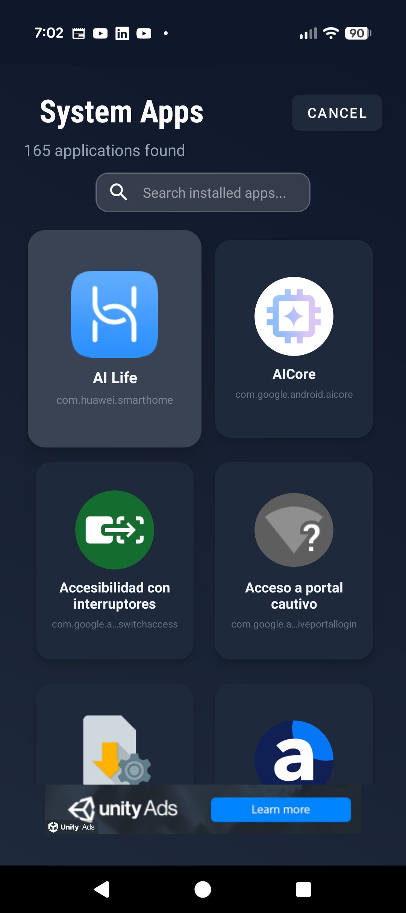

# Vortex One 📱📺

**Vortex One** is your ultimate entertainment and virtualization hub, designed to work perfectly on both **Android TV** and **Mobile Phones**.
It allows you to run multiple accounts of your favorite apps and manage APKs easily, with an adaptive interface that adjusts to your screen.

---

## 📸 Gallery

Explore the versatility of Vortex One in different scenarios:

### 📺 Android TV Experience

Vortex One is optimized for the big screen, with smooth remote control navigation.

| Home Screen | App Management | Installation |
|:---:|:---:|:---:|
|  |  |  |

### 📱 Mobile Experience

Take virtualization with you. Vortex One adapts to your phone screen for intuitive touch control.

| Portrait View | Control Panel | Options Menu |
|:---:|:---:|:---:|
|  |  |  |

---

## ✨ Key Features

- **📱 Multi-Platform**: Enjoy a seamless experience on both your Smart TV with remote control and your Smartphone with touch screen.
- **🎮 Dual Apps**: Have two accounts? Vortex One allows you to clone applications to use multiple sessions at the same time.
- **📥 Smart Installer**: Install APK files directly from your USB or internal storage.
- **🛡️ Secure System**: Applications run in an isolated virtual environment (Sandbox), keeping your main system clean.
- **📺 Designed for TV and Mobile**: Intuitive and user-friendly interface, whether using D-Pad or touch interactions.
- **⚡ Super Lightweight**: Optimized to run fast on any device.

---

## 🚀 How to Use

1. **Open the App**: Launch Vortex One from your device menu.
2. **Install Apps**:
   - Use the **"Install APK"** button to browse `.apk` files on your device.
   - Or use **"System Apps"** to clone applications you already have installed.
3. **Run**: Your cloned apps will appear on the main screen. Simply select them to launch.
4. **Manage**:
   - **On TV**: Long press the select button (OK) on an app.
   - **On Mobile**: Long press on the app icon.

> [!NOTE]
> **Important Notice**: Some applications may require full Google Play Services, which may have limitations in the virtual environment depending on your device.

---

## 👨‍💻 Developer Information

If you are a developer, contributor, or just curious about how Vortex One works under the hood (Technologies, Architecture, BlackBox Integration), check out our technical documentation:

👉 **[Read Developer Documentation (DEVELOPER.md)](DEVELOPER.md)**

---

## 📞 Support

If you need help or have suggestions, contact us:
- **GitHub**: [editech-dev](https://github.com/editech-dev)

---
*Made with ❤️ for the Android community.*
