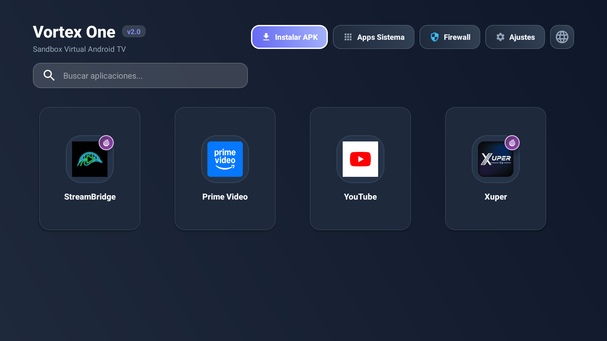
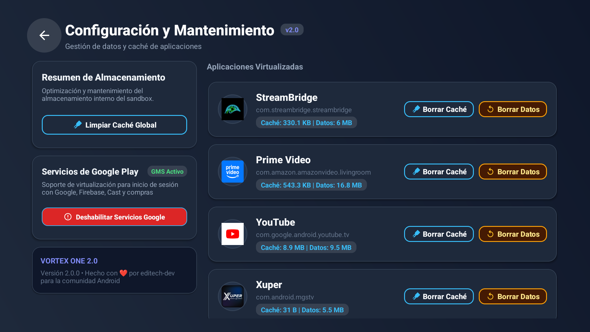
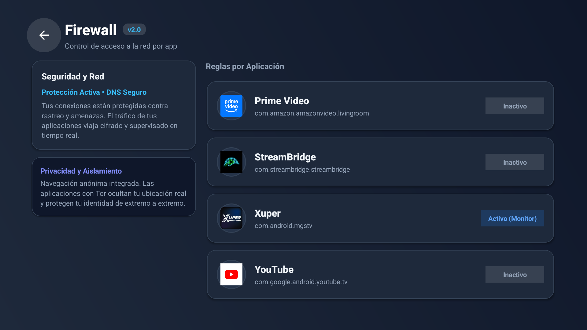

# Vortex One 📱📺

**Vortex One** is a next-generation Android application virtualization engine, privacy suite, and sandbox security hub designed seamlessly for both **Android TV** and **Mobile Devices**.

Run community streaming apps, IPTV players, emulators, and cloned APKs with complete file-system and network isolation. Protect your identity with per-app **Tor routing**, encrypted **DNS-over-TLS (DoT)**, real-time **Firewall inspection**, and native 60 FPS hardware video decoding.

---

## 📥 Downloads (v2.0.1)

Choose the optimal package for your target device:

| Architecture | Recommended Devices | Direct Download Link |
| :--- | :--- | :--- |
| 🌐 **Universal APK** | Smart TVs, TV Boxes, Smartphones (All) | [Download Universal v2.0.1](https://github.com/editech-dev/vortex-one/releases/download/v2.0.1/VortexOne-v2.0.1-universal.apk) |
| ⚡ **ARM64 64-bit** | Modern Smartphones & High-end TV Boxes | [Download ARM64 v2.0.1](https://github.com/editech-dev/vortex-one/releases/download/v2.0.1/VortexOne-v2.0.1-arm64-v8a.apk) |
| 📺 **ARMv7 32-bit** | Smart TVs, TV Sticks & Onn 4K Streaming Boxes | [Download ARMv7 v2.0.1](https://github.com/editech-dev/vortex-one/releases/download/v2.0.1/VortexOne-v2.0.1-armeabi-v7a.apk) |

---

## 📸 Interface Preview (Android TV 16:9 Experience)

Capturas de pantalla reales capturadas directamente desde **Onn 4K Streaming Box (Android 14)**:

| 📺 Home Dashboard | ⚙️ Storage & GMS Services | 🛡️ Firewall & Traffic Rules |
| :---: | :---: | :---: |
|  |  |  |
| *Grilla 16:9 con navegación D-Pad y apps comunitarias aisladas* | *Mantenimiento de caché y gestión de Servicios de Google* | *Monitoreo en tiempo real y reglas de bloqueo de red* |

---

## ✨ Core Features & Technical Highlights

### 🛡️ 1. Embedded Tor Network Privacy Suite
- **Per-App Tor Routing**: Enable or disable Tor routing per virtual app with zero interference with host system network traffic.
- **Embedded Tor Daemon**: Runs an embedded native Tor binary (`libtor.so`) with local SOCKS5 proxy (`127.0.0.1:9050`).
- **Zero DNS Leaks & ISP Block Bypass**: Libcore socket interception ([`OsStub.java`](file:///home/edison/AndroidStudioProjects/MediaService/engine/Bcore/src/main/java/top/niunaijun/blackbox/fake/service/libcore/OsStub.java)) maps domain names to local virtual IPs (`127.42.0.0/16`), forcing DNS queries through Tor exit nodes (`ATYP 0x03`).
- **Fail-Safe Kill-Switch**: Automatically blocks unencrypted IP leaks if the Tor daemon disconnects (`TOR/BLOCKED`).
- **New Identity Action**: On-demand circuit renewal (`NEWNYM`).

### 🔒 2. DNS-over-TLS (DoT / RFC 7858) & Cloudflare Secure DNS
- **RFC 7858 Encrypted DNS**: Resolves domain names over TLS on port 853 (`1.1.1.1:853`) for all non-Tor applications.
- **High-Speed In-Memory LRU Cache**: Sub-millisecond repeat resolutions with 5-minute TTL.
- **Fail-Safe Fallback**: Instant failover to Cloudflare Direct UDP (`1.1.1.1:53`) and system resolver to prevent connection timeouts.

### 🧩 3. Google Play Services (GMS) & In-App Billing Bridge
- **`IGmsServiceBroker` Reflection Bridge**: Dynamic parameter reflection in [`GmsProxy.java`](file:///home/edison/AndroidStudioProjects/MediaService/engine/Bcore/src/main/java/top/niunaijun/blackbox/fake/service/GmsProxy.java) enables **Google Sign-In**, Firebase Auth, and Google Maps in virtual apps without security crashes.
- **Google Cast Support**: Socket and mDNS pass-through allows community media players to stream video to Chromecast/Google TV devices.
- **In-App Billing Stub**: [`IInAppBillingServiceProxy.java`](file:///home/edison/AndroidStudioProjects/MediaService/engine/Bcore/src/main/java/top/niunaijun/blackbox/fake/service/IInAppBillingServiceProxy.java) responds to license verification calls for Pro/Premium community tools.
- **Clean UI Filtering**: Infrastructure packages (`com.google.android.gms`, `com.android.vending`) run silently in the background and are excluded from the main launcher grid for an uncluttered UX.

### 🚀 4. Android TV Leanback & 60 FPS Hardware Acceleration
- **Native Leanback Launch Intent**: [`BPackageManager.java`](file:///home/edison/AndroidStudioProjects/MediaService/engine/Bcore/src/main/java/top/niunaijun/blackbox/fake/frameworks/BPackageManager.java) automatically resolves `Intent.CATEGORY_LEANBACK_LAUNCHER` for TV-only applications.
- **Mali / Amlogic Hardware Decoding**: Exposes true SoC properties in [`VirtualSpoof.cpp`](file:///home/edison/AndroidStudioProjects/MediaService/engine/Bcore/src/main/cpp/Utils/VirtualSpoof.cpp) for native ExoPlayer, VLC, and ijkplayer hardware acceleration at full 60 FPS.
- **Android 13/14 Compatibility**: Dedicated [`ILocaleManagerProxy.java`](file:///home/edison/AndroidStudioProjects/MediaService/engine/Bcore/src/main/java/top/niunaijun/blackbox/fake/service/ILocaleManagerProxy.java) prevents modern IPC `SecurityException` errors.

### 🔥 5. Integrated Firewall & Traffic Monitor
- **Socket Level Inspection**: Monitor inbound and outbound TCP/UDP traffic per package.
- **Custom Rule Engine**: Block specific ports, endpoints, and telemetry servers.
- **Bandwidth Throttling**: Configure custom Upload/Download speed limits per app.
- **Room Database with Auto-Pruning**: Automated 7-day log retention keeping memory usage under 3.5%.

---

## 📜 Version 2.0.1 Changelog
 
> [!NOTE]
> **Key Enhancements in v2.0.1:**
> - **In-App Sandbox Updates**: Added automated internal processing of `Intent.ACTION_VIEW` (`application/vnd.android.package-archive`) within `ClientConfiguration.requestInstallPackage`.
> - **Read-Only Overwrite Fix (EACCES)**: Fixed `CopyExecutor` and `NativeUtils` to safely clear read-only permissions (`chmod 600` / `delete`) on target `base.apk` and `.so` libraries before performing updates.
> - **Version Enforcement & Protection**: Integrated strict package verification preventing downgrade attacks (`newVersionCode >= currentVersionCode`), host package spoofing, and unsupported ABI installations.
> - **StreamBridge & Streaming App Support**: Fully verified smooth execution and seamless in-app updates for live TV streaming apps (StreamBridge, etc.) with hardware-accelerated video decoding.

---

## 📜 Version 2.0.0 Changelog

> [!NOTE]
> **Key Enhancements in v2.0.0:**
> - **Android TV Leanback Support**: Full compatibility with TV-only apps via `CATEGORY_LEANBACK_LAUNCHER`.
> - **Google Play Services Virtualization**: Added `GmsProxy` reflection and `IInAppBillingServiceProxy` for Cast, Auth, and Purchases.
> - **DNS-over-TLS (DoT)**: Added `CloudflareDnsResolver` with RFC 7858 TLS encryption on port 853.
> - **GPU Hardware Pass-through**: Cleaned `VirtualSpoof.cpp` to enable native Mali GPU 60 FPS video decoding on Amlogic chipsets.
> - **LocaleManager Hook**: Added `ILocaleManagerProxy` for seamless Android 14 (API 34) execution.
> - **Streamlined UI/UX**: Filtered internal infrastructure packages from the launcher, settings, and firewall lists.
> - **Zero-Leak Tor Privacy**: Integrated remote DNS resolution with virtual IP mapping and fail-safe Kill-Switch.

---

## 🚀 Getting Started

1. **Install Vortex One**: Download the APK matching your device architecture.
2. **Add Applications**:
   - Click **"System Apps"** to clone apps already installed on your host device.
   - Click **"Install APK"** to import `.apk` files directly from internal storage or a USB drive.
3. **Configure Privacy & Firewall**:
   - Open **Firewall** -> Select an app -> Go to **Tor** tab to activate Tor protection.
   - Monitor live traffic under **Logs**.
4. **Manage Google Services**:
   - Open **Settings** -> Toggle **Google Play Services** on or off per virtual user.
5. **Launch**: Click any cloned app card to start its isolated virtual session.

---

## 👨‍💻 Technical Documentation

For developers, contributors, and detailed architecture notes (Virtual Engine, Libcore Hooks, Inter-Process Communication):

👉 **[Read Developer Guide (DEVELOPER.md)](DEVELOPER.md)**  
👉 **[Read AI Agents Directory (agents.md)](agents.md)**

---

## 🙏 Acknowledgments

Vortex One relies on these outstanding open-source projects:

- **[BlackBox](https://github.com/FBlackBox/BlackBox)** — Virtual engine by **ALEX502** (Apache 2.0). Core virtualization layer.
- **[Tor Android](https://github.com/guardianproject/tor-android)** — Embedded Tor binaries by Guardian Project.
- **VirtualApp / VirtualAPK** — Original virtualization concepts.
- **Dobby & xDL** — Native inline hook framework and dynamic linker utilities.

---

*Built with ❤️ by [editech-dev](https://github.com/editech-dev) for the Android Community.*
