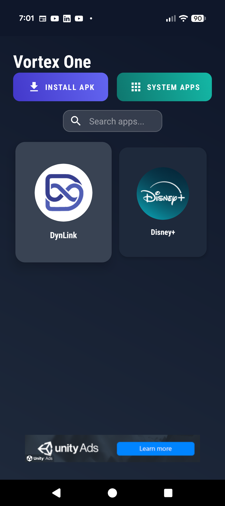
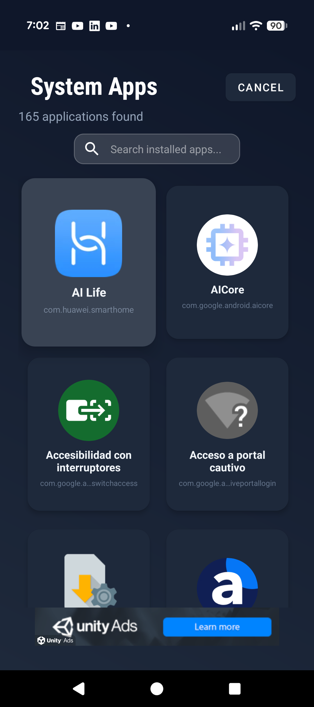
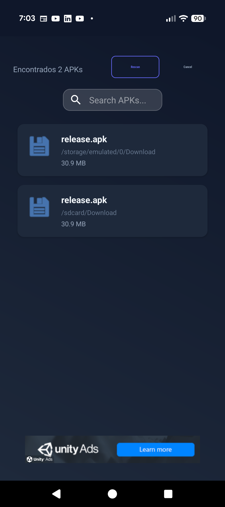

# Vortex One 📱📺

**Vortex One** is an advanced application virtualization engine, privacy suite, and multi-account hub designed seamlessly for both **Android TV** and **Mobile Phones**.

Run multiple instances of your favorite apps, route network traffic through the **Tor Network** on a per-app basis, inspect real-time connections with an integrated **Firewall**, and manage app storage with an adaptive interface built for D-Pad and Touch control.

---

## 📥 Downloads (v1.0.4)

Choose the optimal package for your target device:

| Architecture | Recommended Devices | Direct Download Link |
| :--- | :--- | :--- |
| 🌐 **Universal APK** | Smart TVs, TV Boxes, Smartphones (All) | [Download Universal v1.0.4](https://github.com/editech-dev/vortex-one/releases/download/v1.0.4/VortexOne-v1.0.4-universal.apk) |
| ⚡ **ARM64 64-bit** | Modern Smartphones & High-end TV Boxes | [Download ARM64 v1.0.4](https://github.com/editech-dev/vortex-one/releases/download/v1.0.4/VortexOne-v1.0.4-arm64-v8a.apk) |
| 📺 **ARMv7 32-bit** | Legacy Smart TVs & Entry-level TV Stick | [Download ARMv7 v1.0.4](https://github.com/editech-dev/vortex-one/releases/download/v1.0.4/VortexOne-v1.0.4-armeabi-v7a.apk) |

---

## 📸 Interface Preview

### 📺 Android TV Experience
Optimized for Leanback navigation with remote control (D-Pad).

| Home Dashboard | App Details & Tor Setup | Firewall Inspection |
|:---:|:---:|:---:|
|  |  |  |

### 📱 Mobile Experience
Adaptive layout for smartphones with touch controls.

| Portrait View | Control Panel | App Options |
|:---:|:---:|:---:|
|  |  |  |

---

## ✨ Core Features & Technical Highlights

### 🛡️ 1. Embedded Tor Network Privacy Suite
- **Per-App Tor Routing**: Enable or disable Tor routing per virtual app without affecting other apps or system traffic.
- **Embedded Tor Daemon**: Runs an embedded Tor binary (`127.0.0.1:9150`) with control port management (`9151`).
- **Fail-Safe Kill-Switch**: Native socket interception (`OsStub.java`) automatically blocks unencrypted IP leaks if Tor is disconnected (`TOR/BLOCKED`).
- **Grace Period Protection**: 1.2s (3 retries) bootstrapping window to prevent false connection drops while Tor establishes circuits.
- **New Identity Action**: On-demand IP identity renewal (`NEWNYM`).

### 🔥 2. Integrated Firewall & Real-Time Traffic Monitor
- **Socket Level Inspection**: Monitor inbound and outbound TCP/UDP connections for every virtualized package.
- **Rules Engine**: Block specific ports, endpoints, ADB access, and local network probes.
- **Bandwidth Throttling**: Configure custom Upload/Download speed limits per app.
- **Centralized Connection Logs**: Real-time traffic log viewer with onion badges for Tor traffic (`TOR/TCP`).
- **Automated Storage Rotation**: 7-day SQLite log retention with a 500-record cap for minimal memory footprint.

### 🎮 3. Multi-Platform & Adaptive UX
- **Android TV & D-Pad**: Custom focus states (`#38BDF8` neon highlight) and global key dispatching (`dispatchKeyEvent`) for D-Pad controllers.
- **Mobile Touch Native**: Optimized touch handlers with instant response on smartphones.
- **Storage & Cache Manager**: Inspect virtual app sizes, clear cache, or reset app data safely from Settings.

---

## 📜 Version 1.0.4 Changelog

> [!NOTE]
> **Summary of recent fixes & enhancements:**
> - **Tor Lifecycle & Auto-Boot**: Automatically launches `TorService` on app startup if any virtualized app has Tor enabled.
> - **UI Thread Safety**: Asynchronous socket check prevents `NetworkOnMainThreadException` crashes, ensuring status reads **"Tor activo"** (Green).
> - **Grace Period Hook**: Retries proxy connection up to 3 times before applying the Kill-Switch.
> - **Log Retention**: Background pruning cleans up logs older than 7 days.
> - **D-Pad Fixes**: Intercepts `KEYCODE_DPAD_DOWN` to navigate seamlessly from tabs to content lists.

---

## 🚀 Getting Started

1. **Install Vortex One**: Download the APK matching your device architecture.
2. **Clone Apps**:
   - Click **"System Apps"** to clone applications installed on your system.
   - Click **"Install APK"** to import `.apk` files directly from internal storage or USB.
3. **Configure Privacy & Firewall**:
   - Open **Firewall** -> Select an app -> Go to **Tor** tab to activate Tor protection.
   - View live traffic under **Logs**.
4. **Launch**: Click any cloned app card to start its isolated virtual session.

> [!IMPORTANT]
> Some applications requiring strict Google Play Services or SafetyNet/Play Integrity may have limited functionality in virtual sandboxes depending on your Android OS version.

---

## 👨‍💻 Technical Documentation

For developers, contributors, and detailed architecture notes (Virtual Engine, Libcore Hooks, Inter-Process Communication):

👉 **[Read Developer Guide (DEVELOPER.md)](DEVELOPER.md)**

---

## 🙏 Acknowledgments

Vortex One relies on these outstanding open-source projects:

- **[BlackBox](https://github.com/FBlackBox/BlackBox)** — Virtual engine by **ALEX502** (Apache 2.0). Core virtualization layer.
- **[Tor Android](https://github.com/guardianproject/tor-android)** — Embedded Tor binaries by Guardian Project.
- **VirtualApp / VirtualAPK** — Original virtualization concepts.
- **Dobby & xDL** — Native inline hook framework and dynamic linker utilities.

---

*Built with ❤️ by [editech-dev](https://github.com/editech-dev) for the Android Community.*
